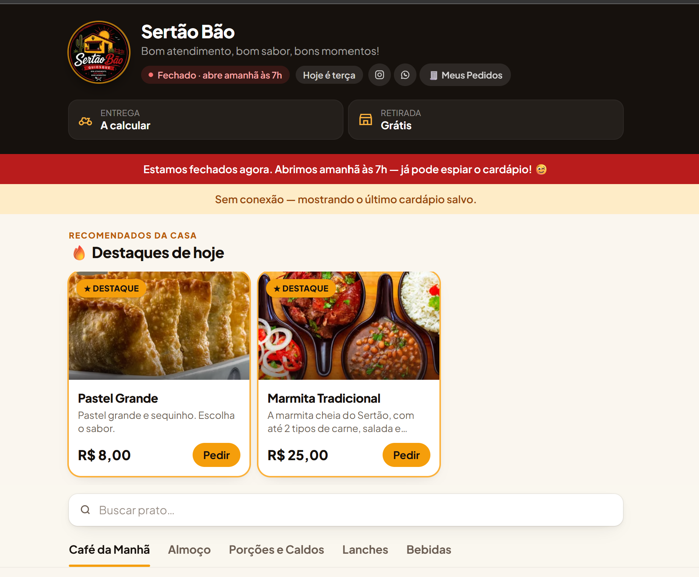
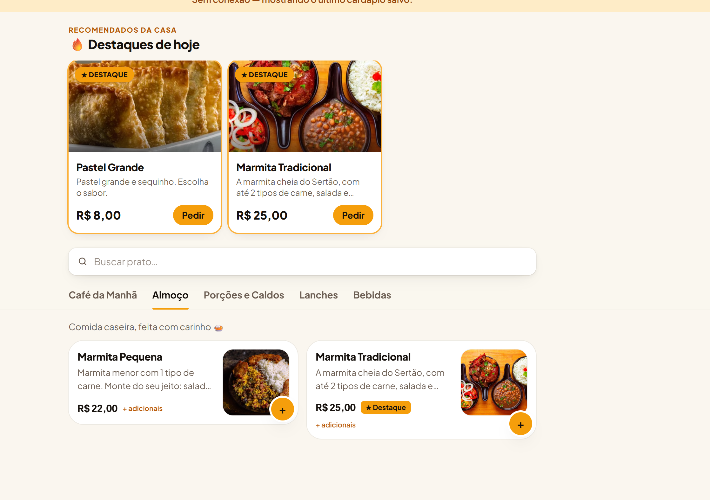
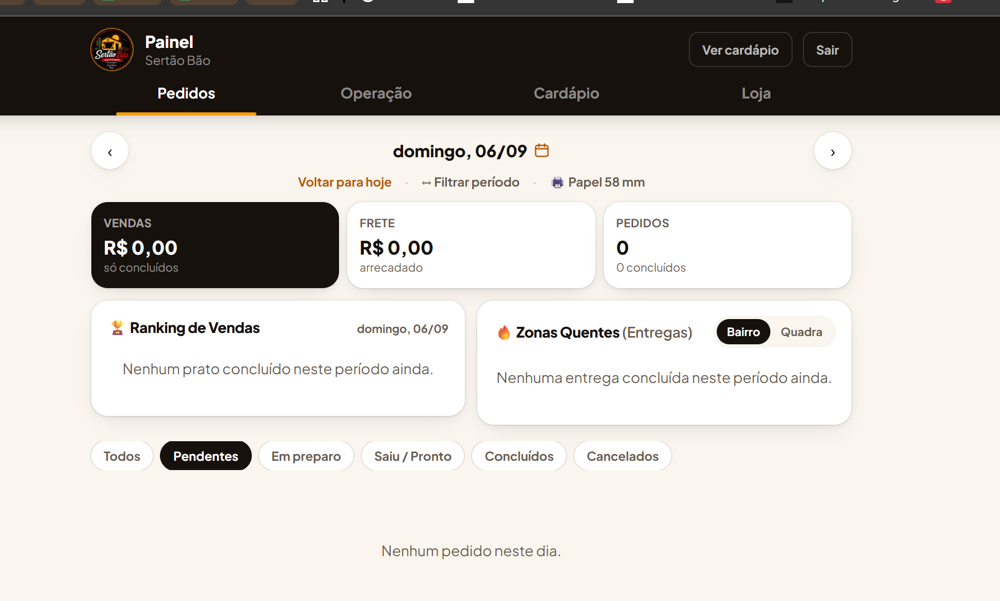
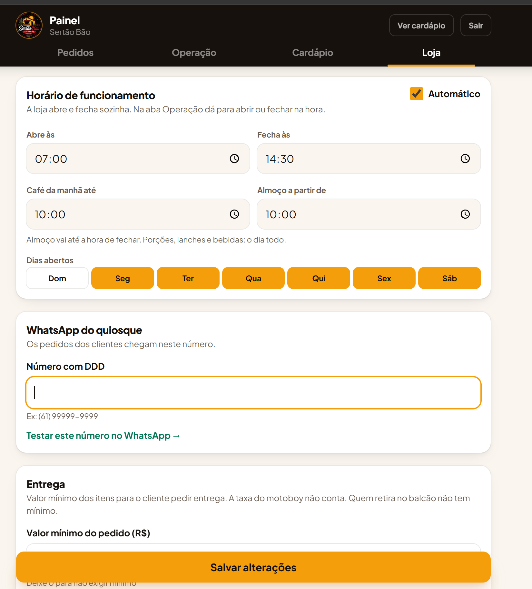

# Sertão Bão — cardápio digital e pedidos

Site de pedidos do quiosque da minha mãe, no DF. Está no ar desde setembro de 2026 e é usado todo dia: o cliente monta o pedido no celular e ele chega pronto no WhatsApp do quiosque. Do outro lado, um painel mostra os pedidos em tempo real e o caixa do dia.

**Site:** https://sertaobao.netlify.app

| Cardápio | Almoço com adicionais |
|---|---|
|  |  |

| Painel: pedidos e caixa do dia | Painel: horário e configurações |
|---|---|
|  |  |

## O que ele faz

Para o cliente: cardápio por categoria, pratos com opções e adicionais (ex.: escolher 2 carnes na marmita), sacola, checkout com entrega ou retirada e envio do pedido para o WhatsApp. Também dá para acompanhar o pedido depois.

Para o quiosque: login, edição do cardápio e das fotos, lista de pedidos com alarme quando chega um novo, resumo de vendas, ranking dos pratos, bairros com mais entregas e impressão da comanda na impressora térmica.

## Decisões técnicas

- **Sem framework e sem build.** HTML, JavaScript puro e Tailwind via CDN. O quiosque não tem ninguém de TI, então eu queria algo que eu mesmo conseguisse manter e publicar arrastando a pasta no Netlify.
- **Supabase como back-end.** PostgreSQL, login, fotos e tempo real no mesmo lugar, no plano gratuito.
- **Segurança no banco, não no front.** A chave que aparece no código é a publicável; quem decide o que cada um pode ler ou gravar são as regras de Row Level Security. O site público só tem acesso limitado e o painel exige login.
- **Grupos de opções reutilizáveis.** "Carnes", "Acompanhamentos" etc. são cadastrados uma vez e ligados a vários pratos (tabela `prato_grupos`, relação N:N). Mudou o preço de uma carne, muda em todas as marmitas.
- **Horário pelo fuso de São Paulo.** A loja abre e fecha sozinha e o café da manhã some às 10h, independente do fuso do celular do cliente.
- **O carrinho se corrige sozinho.** Se um prato esgota ou muda de preço enquanto o cliente monta o pedido, a sacola é revalidada e ele recebe um aviso.
- **Funciona sem internet.** O último cardápio fica salvo no navegador; sem conexão, o site mostra esse cardápio com um aviso (aparece no primeiro print).

## Como eu fiz

Escrevi o código com ajuda de IA (Claude). Minha parte foi levantar com o quiosque o que precisava, decidir como montar o banco e em que ordem construir, revisar e testar cada parte no celular e no painel, carregar o cardápio real via SQL, publicar e manter. Quando algo quebra ou o quiosque pede mudança, sou eu que resolvo.

## Estrutura do código

Os arquivos são scripts normais (não módulos) e dividem as mesmas variáveis globais, então **a ordem dos `<script>` no `index.html` importa**.

```
index.html          página, modais e ordem dos scripts
css/estilos.css     CSS próprio (o resto é Tailwind nas classes)
js/
  util.js           dinheiro, horário de funcionamento, disponibilidade
  estado.js         estado da página
  supabase.js       conexão, carregamento do cardápio, cache e tempo real
  loja/             o que o cliente vê (vitrine, sacola, checkout, gravar pedido)
  admin/            painel (#admin): cardápio, pedidos, alarme, caixa, comanda
  cliente/          meus pedidos e rastreio
  main.js           inicialização (sempre o último)
```

Para rodar: abrir o `index.html` ou publicar a pasta. Sem Supabase configurado, o site usa o cardápio de exemplo em `js/dados/`.
